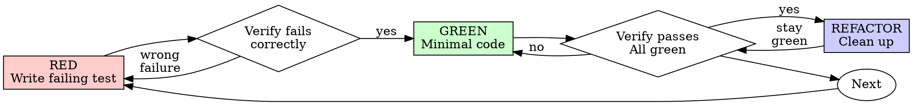

# Elite Qa Architect


## Section: applying-tdd

# Test-Driven Development (TDD)

## Overview

Write the test first. Watch it fail. Write minimal code to pass.

**Core principle:** If you didn't watch the test fail, you don't know if it tests the right thing.

**Violating the letter of the rules is violating the spirit of the rules.**

## When to Use

**Always:**
- New features
- Bug fixes
- Refactoring
- Behavior changes

**Exceptions (ask your human partner):**
- Throwaway prototypes
- Generated code
- Configuration files

Thinking "skip TDD just this once"? Stop. That's rationalization.

## The Iron Law

```
NO PRODUCTION CODE WITHOUT A FAILING TEST FIRST
```

Write code before the test? Delete it. Start over.

**No exceptions:**
- Don't keep it as "reference"
- Don't "adapt" it while writing tests
- Don't look at it
- Delete means delete

Implement fresh from tests. Period.

## Red-Green-Refactor



### RED - Write Failing Test

Write one minimal test showing what should happen.

<Good>
```typescript
test('retries failed operations 3 times', async () => {
  let attempts = 0;
  const operation = () => {
    attempts++;
    if (attempts < 3) throw new Error('fail');
    return 'success';
  };

  const result = await retryOperation(operation);

  expect(result).toBe('success');
  expect(attempts).toBe(3);
});
```
Clear name, tests real behavior, one thing
</Good>

<Bad>
```typescript
test('retry works', async () => {
  const mock = jest.fn()
    .mockRejectedValueOnce(new Error())
    .mockRejectedValueOnce(new Error())
    .mockResolvedValueOnce('success');
  await retryOperation(mock);
  expect(mock).toHaveBeenCalledTimes(3);
});
```
Vague name, tests mock not code
</Bad>

**Requirements:**
- One behavior
- Clear name
- Real code (no mocks unless unavoidable)

### Verify RED - Watch It Fail

**MANDATORY. Never skip.**

```bash
npm test path/to/test.test.ts
```

Confirm:
- Test fails (not errors)
- Failure message is expected
- Fails because feature missing (not typos)

**Test passes?** You're testing existing behavior. Fix test.

**Test errors?** Fix error, re-run until it fails correctly.

### GREEN - Minimal Code

Write simplest code to pass the test.

<Good>
```typescript
async function retryOperation<T>(fn: () => Promise<T>): Promise<T> {
  for (let i = 0; i < 3; i++) {
    try {
      return await fn();
    } catch (e) {
      if (i === 2) throw e;
    }
  }
  throw new Error('unreachable');
}
```
Just enough to pass
</Good>

<Bad>
```typescript
async function retryOperation<T>(
  fn: () => Promise<T>,
  options?: {
    maxRetries?: number;
    backoff?: 'linear' | 'exponential';
    onRetry?: (attempt: number) => void;
  }
): Promise<T> {
  // YAGNI
}
```
Over-engineered
</Bad>

Don't add features, refactor other code, or "improve" beyond the test.

### Verify GREEN - Watch It Pass

**MANDATORY.**

```bash
npm test path/to/test.test.ts
```

Confirm:
- Test passes
- Other tests still pass
- Output pristine (no errors, warnings)

**Test fails?** Fix code, not test.

**Other tests fail?** Fix now.

### REFACTOR - Clean Up

After green only:
- Remove duplication
- Improve names
- Extract helpers

Keep tests green. Don't add behavior.

### Repeat

Next failing test for next feature.

## Good Tests

| Quality | Good | Bad |
|---------|------|-----|
| **Minimal** | One thing. "and" in name? Split it. | `test('validates email and domain and whitespace')` |
| **Clear** | Name describes behavior | `test('test1')` |
| **Shows intent** | Demonstrates desired API | Obscures what code should do |

## Why Order Matters

**"I'll write tests after to verify it works"**

Tests written after code pass immediately. Passing immediately proves nothing:
- Might test wrong thing
- Might test implementation, not behavior
- Might miss edge cases you forgot
- You never saw it catch the bug

Test-first forces you to see the test fail, proving it actually tests something.

**"I already manually tested all the edge cases"**

Manual testing is ad-hoc. You think you tested everything but:
- No record of what you tested
- Can't re-run when code changes
- Easy to forget cases under pressure
- "It worked when I tried it" ≠ comprehensive

Automated tests are systematic. They run the same way every time.

**"Deleting X hours of work is wasteful"**

Sunk cost fallacy. The time is already gone. Your choice now:
- Delete and rewrite with TDD (X more hours, high confidence)
- Keep it and add tests after (30 min, low confidence, likely bugs)

The "waste" is keeping code you can't trust. Working code without real tests is technical debt.

**"TDD is dogmatic, being pragmatic means adapting"**

TDD IS pragmatic:
- Finds bugs before commit (faster than debugging after)
- Prevents regressions (tests catch breaks immediately)
- Documents behavior (tests show how to use code)
- Enables refactoring (change freely, tests catch breaks)

"Pragmatic" shortcuts = debugging in production = slower.

**"Tests after achieve the same goals - it's spirit not ritual"**

No. Tests-after answer "What does this do?" Tests-first answer "What should this do?"

Tests-after are biased by your implementation. You test what you built, not what's required. You verify remembered edge cases, not discovered ones.

Tests-first force edge case discovery before implementing. Tests-after verify you remembered everything (you didn't).

30 minutes of tests after ≠ TDD. You get coverage, lose proof tests work.

## Common Rationalizations

| Excuse | Reality |
|--------|---------|
| "Too simple to test" | Simple code breaks. Test takes 30 seconds. |
| "I'll test after" | Tests passing immediately prove nothing. |
| "Tests after achieve same goals" | Tests-after = "what does this do?" Tests-first = "what should this do?" |
| "Already manually tested" | Ad-hoc ≠ systematic. No record, can't re-run. |
| "Deleting X hours is wasteful" | Sunk cost fallacy. Keeping unverified code is technical debt. |
| "Keep as reference, write tests first" | You'll adapt it. That's testing after. Delete means delete. |
| "Need to explore first" | Fine. Throw away exploration, start with TDD. |
| "Test hard = design unclear" | Listen to test. Hard to test = hard to use. |
| "TDD will slow me down" | TDD faster than debugging. Pragmatic = test-first. |
| "Manual test faster" | Manual doesn't prove edge cases. You'll re-test every change. |
| "Existing code has no tests" | You're improving it. Add tests for existing code. |

## Red Flags - STOP and Start Over

- Code before test
- Test after implementation
- Test passes immediately
- Can't explain why test failed
- Tests added "later"
- Rationalizing "just this once"
- "I already manually tested it"
- "Tests after achieve the same purpose"
- "It's about spirit not ritual"
- "Keep as reference" or "adapt existing code"
- "Already spent X hours, deleting is wasteful"
- "TDD is dogmatic, I'm being pragmatic"
- "This is different because..."

**All of these mean: Delete code. Start over with TDD.**

## Example: Bug Fix

**Bug:** Empty email accepted

**RED**
```typescript
test('rejects empty email', async () => {
  const result = await submitForm({ email: '' });
  expect(result.error).toBe('Email required');
});
```

**Verify RED**
```bash
$ npm test
FAIL: expected 'Email required', got undefined
```

**GREEN**
```typescript
function submitForm(data: FormData) {
  if (!data.email?.trim()) {
    return { error: 'Email required' };
  }
  // ...
}
```

**Verify GREEN**
```bash
$ npm test
PASS
```

**REFACTOR**
Extract validation for multiple fields if needed.

## Verification Checklist

Before marking work complete:

- [ ] Every new function/method has a test
- [ ] Watched each test fail before implementing
- [ ] Each test failed for expected reason (feature missing, not typo)
- [ ] Wrote minimal code to pass each test
- [ ] All tests pass
- [ ] Output pristine (no errors, warnings)
- [ ] Tests use real code (mocks only if unavoidable)
- [ ] Edge cases and errors covered

Can't check all boxes? You skipped TDD. Start over.

## When Stuck

| Problem | Solution |
|---------|----------|
| Don't know how to test | Write wished-for API. Write assertion first. Ask your human partner. |
| Test too complicated | Design too complicated. Simplify interface. |
| Must mock everything | Code too coupled. Use dependency injection. |
| Test setup huge | Extract helpers. Still complex? Simplify design. |

## Debugging Integration

Bug found? Write failing test reproducing it. Follow TDD cycle. Test proves fix and prevents regression.

Never fix bugs without a test.

## Testing Anti-Patterns

When adding mocks or test utilities, read [testing-anti-patterns.md](resources/testing-anti-patterns.md) to avoid common pitfalls:
- Testing mock behavior instead of real behavior
- Adding test-only methods to production classes
- Mocking without understanding dependencies

## Final Rule

```
Production code → test exists and failed first
Otherwise → not TDD
```

No exceptions without your human partner's permission.


## Section: debugging-systematically

# Systematic Debugging

## Overview

Random fixes waste time and create new bugs. Quick patches mask underlying issues.

**Core principle:** ALWAYS find root cause before attempting fixes. Symptom fixes are failure.

**Violating the letter of this process is violating the spirit of debugging.**

## The Iron Law

```
NO FIXES WITHOUT ROOT CAUSE INVESTIGATION FIRST
```

If you haven't completed Phase 1, you cannot propose fixes.

## When to Use

Use for ANY technical issue:
- Test failures
- Bugs in production
- Unexpected behavior
- Performance problems
- Build failures
- Integration issues

**Use this ESPECIALLY when:**
- Under time pressure (emergencies make guessing tempting)
- "Just one quick fix" seems obvious
- You've already tried multiple fixes
- Previous fix didn't work
- You don't fully understand the issue

**Don't skip when:**
- Issue seems simple (simple bugs have root causes too)
- You're in a hurry (rushing guarantees rework)
- Manager wants it fixed NOW (systematic is faster than thrashing)

## The Four Phases

You MUST complete each phase before proceeding to the next.

### Phase 1: Root Cause Investigation

**BEFORE attempting ANY fix:**

1. **Read Error Messages Carefully**
   - Don't skip past errors or warnings
   - They often contain the exact solution
   - Read stack traces completely
   - Note line numbers, file paths, error codes

2. **Reproduce Consistently**
   - Can you trigger it reliably?
   - What are the exact steps?
   - Does it happen every time?
   - If not reproducible → gather more data, don't guess

3. **Check Recent Changes**
   - What changed that could cause this?
   - Git diff, recent commits
   - New dependencies, config changes
   - Environmental differences

4. **Gather Evidence in Multi-Component Systems**

   **WHEN system has multiple components (CI → build → signing, API → service → database):**

   **BEFORE proposing fixes, add diagnostic instrumentation:**
   ```
   For EACH component boundary:
     - Log what data enters component
     - Log what data exits component
     - Verify environment/config propagation
     - Check state at each layer

   Run once to gather evidence showing WHERE it breaks
   THEN analyze evidence to identify failing component
   THEN investigate that specific component
   ```

   **Example (multi-layer system):**
   ```bash
   # Layer 1: Workflow
   echo "=== Secrets available in workflow: ==="
   echo "IDENTITY: ${IDENTITY:+SET}${IDENTITY:-UNSET}"

   # Layer 2: Build script
   echo "=== Env vars in build script: ==="
   env | grep IDENTITY || echo "IDENTITY not in environment"

   # Layer 3: Signing script
   echo "=== Keychain state: ==="
   security list-keychains
   security find-identity -v

   # Layer 4: Actual signing
   codesign --sign "$IDENTITY" --verbose=4 "$APP"
   ```

   **This reveals:** Which layer fails (secrets → workflow ✓, workflow → build ✗)

5. **Trace Data Flow**

   **WHEN error is deep in call stack:**

   See [root-cause-tracing.md](resources/root-cause-tracing.md) for the complete backward tracing technique.

   **Quick version:**
   - Where does bad value originate?
   - What called this with bad value?
   - Keep tracing up until you find the source
   - Fix at source, not at symptom

### Phase 2: Pattern Analysis

**Find the pattern before fixing:**

1. **Find Working Examples**
   - Locate similar working code in same codebase
   - What works that's similar to what's broken?

2. **Compare Against References**
   - If implementing pattern, read reference implementation COMPLETELY
   - Don't skim - read every line
   - Understand the pattern fully before applying

3. **Identify Differences**
   - What's different between working and broken?
   - List every difference, however small
   - Don't assume "that can't matter"

4. **Understand Dependencies**
   - What other components does this need?
   - What settings, config, environment?
   - What assumptions does it make?

### Phase 3: Hypothesis and Testing

**Scientific method:**

1. **Form Single Hypothesis**
   - State clearly: "I think X is the root cause because Y"
   - Write it down
   - Be specific, not vague

2. **Test Minimally**
   - Make the SMALLEST possible change to test hypothesis
   - One variable at a time
   - Don't fix multiple things at once

3. **Verify Before Continuing**
   - Did it work? Yes → Phase 4
   - Didn't work? Form NEW hypothesis
   - DON'T add more fixes on top

4. **When You Don't Know**
   - Say "I don't understand X"
   - Don't pretend to know
   - Ask for help
   - Research more

### Phase 4: Implementation

**Fix the root cause, not the symptom:**

1. **Create Failing Test Case**
   - Simplest possible reproduction
   - Automated test if possible
   - One-off test script if no framework
   - MUST have before fixing
   - Use the `superpowers:test-driven-development` skill for writing proper failing tests

2. **Implement Single Fix**
   - Address the root cause identified
   - ONE change at a time
   - No "while I'm here" improvements
   - No bundled refactoring

3. **Verify Fix**
   - Test passes now?
   - No other tests broken?
   - Issue actually resolved?

4. **If Fix Doesn't Work**
   - STOP
   - Count: How many fixes have you tried?
   - If < 3: Return to Phase 1, re-analyze with new information
   - **If ≥ 3: STOP and question the architecture (step 5 below)**
   - DON'T attempt Fix #4 without architectural discussion

5. **If 3+ Fixes Failed: Question Architecture**

   **Pattern indicating architectural problem:**
   - Each fix reveals new shared state/coupling/problem in different place
   - Fixes require "massive refactoring" to implement
   - Each fix creates new symptoms elsewhere

   **STOP and question fundamentals:**
   - Is this pattern fundamentally sound?
   - Are we "sticking with it through sheer inertia"?
   - Should we refactor architecture vs. continue fixing symptoms?

   **Discuss with your human partner before attempting more fixes**

   This is NOT a failed hypothesis - this is a wrong architecture.

## Red Flags - STOP and Follow Process

If you catch yourself thinking:
- "Quick fix for now, investigate later"
- "Just try changing X and see if it works"
- "Add multiple changes, run tests"
- "Skip the test, I'll manually verify"
- "It's probably X, let me fix that"
- "I don't fully understand but this might work"
- "Pattern says X but I'll adapt it differently"
- "Here are the main problems: [lists fixes without investigation]"
- Proposing solutions before tracing data flow
- **"One more fix attempt" (when already tried 2+)**
- **Each fix reveals new problem in different place**

**ALL of these mean: STOP. Return to Phase 1.**

**If 3+ fixes failed:** Question the architecture (see Phase 4.5)

## your human partner's Signals You're Doing It Wrong

**Watch for these redirections:**
- "Is that not happening?" - You assumed without verifying
- "Will it show us...?" - You should have added evidence gathering
- "Stop guessing" - You're proposing fixes without understanding
- "Ultrathink this" - Question fundamentals, not just symptoms
- "We're stuck?" (frustrated) - Your approach isn't working

**When you see these:** STOP. Return to Phase 1.

## Common Rationalizations

| Excuse | Reality |
|--------|---------|
| "Issue is simple, don't need process" | Simple issues have root causes too. Process is fast for simple bugs. |
| "Emergency, no time for process" | Systematic debugging is FASTER than guess-and-check thrashing. |
| "Just try this first, then investigate" | First fix sets the pattern. Do it right from the start. |
| "I'll write test after confirming fix works" | Untested fixes don't stick. Test first proves it. |
| "Multiple fixes at once saves time" | Can't isolate what worked. Causes new bugs. |
| "Reference too long, I'll adapt the pattern" | Partial understanding guarantees bugs. Read it completely. |
| "I see the problem, let me fix it" | Seeing symptoms ≠ understanding root cause. |
| "One more fix attempt" (after 2+ failures) | 3+ failures = architectural problem. Question pattern, don't fix again. |

## Quick Reference

| Phase | Key Activities | Success Criteria |
|-------|---------------|------------------|
| **1. Root Cause** | Read errors, reproduce, check changes, gather evidence | Understand WHAT and WHY |
| **2. Pattern** | Find working examples, compare | Identify differences |
| **3. Hypothesis** | Form theory, test minimally | Confirmed or new hypothesis |
| **4. Implementation** | Create test, fix, verify | Bug resolved, tests pass |

## When Process Reveals "No Root Cause"

If systematic investigation reveals issue is truly environmental, timing-dependent, or external:

1. You've completed the process
2. Document what you investigated
3. Implement appropriate handling (retry, timeout, error message)
4. Add monitoring/logging for future investigation

**But:** 95% of "no root cause" cases are incomplete investigation.

## Supporting Techniques

These techniques are part of systematic debugging and available in this directory:

- **[root-cause-tracing.md](resources/root-cause-tracing.md)** - Trace bugs backward through call stack to find original trigger
- **[defense-in-depth.md](resources/defense-in-depth.md)** - Add validation at multiple layers after finding root cause
- **[condition-based-waiting.md](resources/condition-based-waiting.md)** - Replace arbitrary timeouts with condition polling

**Related skills:**
- **superpowers:test-driven-development** - For creating failing test case (Phase 4, Step 1)
- **superpowers:verification-before-completion** - Verify fix worked before claiming success

## Real-World Impact

From debugging sessions:
- Systematic approach: 15-30 minutes to fix
- Random fixes approach: 2-3 hours of thrashing
- First-time fix rate: 95% vs 40%
- New bugs introduced: Near zero vs common


## Section: fixing-tests

# Test Fixing

Systematically identify and fix all failing tests using smart grouping strategies.

## When to Use

- Explicitly asks to fix tests ("fix these tests", "make tests pass")
- Reports test failures ("tests are failing", "test suite is broken")
- Completes implementation and wants tests passing
- Mentions CI/CD failures due to tests

## Systematic Approach

### 1. Initial Test Run

Run `make test` to identify all failing tests.

Analyze output for:

- Total number of failures
- Error types and patterns
- Affected modules/files

### 2. Smart Error Grouping

Group similar failures by:

- **Error type**: ImportError, AttributeError, AssertionError, etc.
- **Module/file**: Same file causing multiple test failure
- **Root cause**: Missing dependencies, API changes, refactoring impacts

Prioritize groups by:

- Number of affected tests (highest impact first)
- Dependency order (fix infrastructure before functionality)

### 3. Systematic Fixing Process

For each group (starting with highest impact):

1. **Identify root cause**

   - Read relevant code
   - Check recent changes with `git diff`
   - Understand the error pattern

2. **Implement fix**

   - Use Edit tool for code changes
   - Follow project conventions (see CLAUDE.md)
   - Make minimal, focused changes

3. **Verify fix**

   - Run subset of tests for this group
   - Use pytest markers or file patterns:
     ```bash
     uv run pytest tests/path/to/test_file.py -v
     uv run pytest -k "pattern" -v
     ```
   - Ensure group passes before moving on

4. **Move to next group**

### 4. Fix Order Strategy

**Infrastructure first:**

- Import errors
- Missing dependencies
- Configuration issues

**Then API changes:**

- Function signature changes
- Module reorganization
- Renamed variables/functions

**Finally, logic issues:**

- Assertion failures
- Business logic bugs
- Edge case handling

### 5. Final Verification

After all groups fixed:

- Run complete test suite: `make test`
- Verify no regressions
- Check test coverage remains intact

## Best Practices

- Fix one group at a time
- Run focused tests after each fix
- Use `git diff` to understand recent changes
- Look for patterns in failures
- Don't move to next group until current passes
- Keep changes minimal and focused

## Example Workflow

User: "The tests are failing after my refactor"

1. Run `make test` → 15 failures identified
2. Group errors:
   - 8 ImportErrors (module renamed)
   - 5 AttributeErrors (function signature changed)
   - 2 AssertionErrors (logic bugs)
3. Fix ImportErrors first → Run subset → Verify
4. Fix AttributeErrors → Run subset → Verify
5. Fix AssertionErrors → Run subset → Verify
6. Run full suite → All pass ✓


## Section: using-testing-patterns

# Testing Patterns and Utilities

## Testing Philosophy

**Test-Driven Development (TDD):**
- Write failing test FIRST
- Implement minimal code to pass
- Refactor after green
- Never write production code without a failing test

**Behavior-Driven Testing:**
- Test behavior, not implementation
- Focus on public APIs and business requirements
- Avoid testing implementation details
- Use descriptive test names that describe behavior

**Factory Pattern:**
- Create `getMockX(overrides?: Partial<X>)` functions
- Provide sensible defaults
- Allow overriding specific properties
- Keep tests DRY and maintainable

## Test Utilities

### Custom Render Function

Create a custom render that wraps components with required providers:

```typescript
// src/utils/testUtils.tsx
import { render } from '@testing-library/react-native';
import { ThemeProvider } from './theme';

export const renderWithTheme = (ui: React.ReactElement) => {
  return render(
    <ThemeProvider>{ui}</ThemeProvider>
  );
};
```

**Usage:**
```typescript
import { renderWithTheme } from 'utils/testUtils';
import { screen } from '@testing-library/react-native';

it('should render component', () => {
  renderWithTheme(<MyComponent />);
  expect(screen.getByText('Hello')).toBeTruthy();
});
```

## Factory Pattern

### Component Props Factory

```typescript
import { ComponentProps } from 'react';

const getMockMyComponentProps = (
  overrides?: Partial<ComponentProps<typeof MyComponent>>
) => {
  return {
    title: 'Default Title',
    count: 0,
    onPress: jest.fn(),
    isLoading: false,
    ...overrides,
  };
};

// Usage in tests
it('should render with custom title', () => {
  const props = getMockMyComponentProps({ title: 'Custom Title' });
  renderWithTheme(<MyComponent {...props} />);
  expect(screen.getByText('Custom Title')).toBeTruthy();
});
```

### Data Factory

```typescript
interface User {
  id: string;
  name: string;
  email: string;
  role: 'admin' | 'user';
}

const getMockUser = (overrides?: Partial<User>): User => {
  return {
    id: '123',
    name: 'John Doe',
    email: 'john@example.com',
    role: 'user',
    ...overrides,
  };
};

// Usage
it('should display admin badge for admin users', () => {
  const user = getMockUser({ role: 'admin' });
  renderWithTheme(<UserCard user={user} />);
  expect(screen.getByText('Admin')).toBeTruthy();
});
```

## Mocking Patterns

### Mocking Modules

```typescript
// Mock entire module
jest.mock('utils/analytics');

// Mock with factory function
jest.mock('utils/analytics', () => ({
  Analytics: {
    logEvent: jest.fn(),
  },
}));

// Access mock in test
const mockLogEvent = jest.requireMock('utils/analytics').Analytics.logEvent;
```

### Mocking GraphQL Hooks

```typescript
jest.mock('./GetItems.generated', () => ({
  useGetItemsQuery: jest.fn(),
}));

const mockUseGetItemsQuery = jest.requireMock(
  './GetItems.generated'
).useGetItemsQuery as jest.Mock;

// In test
mockUseGetItemsQuery.mockReturnValue({
  data: { items: [] },
  loading: false,
  error: undefined,
});
```

## Test Structure

```typescript
describe('ComponentName', () => {
  beforeEach(() => {
    jest.clearAllMocks();
  });

  describe('Rendering', () => {
    it('should render component with default props', () => {});
    it('should render loading state when loading', () => {});
  });

  describe('User interactions', () => {
    it('should call onPress when button is clicked', async () => {});
  });

  describe('Edge cases', () => {
    it('should handle empty data gracefully', () => {});
  });
});
```

## Query Patterns

```typescript
// Element must exist
expect(screen.getByText('Hello')).toBeTruthy();

// Element should not exist
expect(screen.queryByText('Goodbye')).toBeNull();

// Element appears asynchronously
await waitFor(() => {
  expect(screen.findByText('Loaded')).toBeTruthy();
});
```

## User Interaction Patterns

```typescript
import { fireEvent, screen } from '@testing-library/react-native';

it('should submit form on button click', async () => {
  const onSubmit = jest.fn();
  renderWithTheme(<LoginForm onSubmit={onSubmit} />);

  fireEvent.changeText(screen.getByLabelText('Email'), 'user@example.com');
  fireEvent.changeText(screen.getByLabelText('Password'), 'password123');
  fireEvent.press(screen.getByTestId('login-button'));

  await waitFor(() => {
    expect(onSubmit).toHaveBeenCalled();
  });
});
```

## Anti-Patterns to Avoid

### Testing Mock Behavior Instead of Real Behavior

```typescript
// Bad - testing the mock
expect(mockFetchData).toHaveBeenCalled();

// Good - testing actual behavior
expect(screen.getByText('John Doe')).toBeTruthy();
```

### Not Using Factories

```typescript
// Bad - duplicated, inconsistent test data
it('test 1', () => {
  const user = { id: '1', name: 'John', email: 'john@test.com', role: 'user' };
});
it('test 2', () => {
  const user = { id: '2', name: 'Jane', email: 'jane@test.com' }; // Missing role!
});

// Good - reusable factory
const user = getMockUser({ name: 'Custom Name' });
```

## Best Practices

1. **Always use factory functions** for props and data
2. **Test behavior, not implementation**
3. **Use descriptive test names**
4. **Organize with describe blocks**
5. **Clear mocks between tests**
6. **Keep tests focused** - one behavior per test

## Running Tests

```bash
# Run all tests
npm test

# Run with coverage
npm run test:coverage

# Run specific file
npm test ComponentName.test.tsx
```

## Integration with Other Skills

- **react-ui-patterns**: Test all UI states (loading, error, empty, success)
- **systematic-debugging**: Write test that reproduces bug before fixing


## Section: e2e-testing-patterns

# E2E Testing Patterns

Build reliable, fast, and maintainable end-to-end test suites that provide confidence to ship code quickly and catch regressions before users do.

## When to Use This Skill

- Implementing end-to-end test automation
- Debugging flaky or unreliable tests
- Testing critical user workflows
- Setting up CI/CD test pipelines
- Testing across multiple browsers
- Validating accessibility requirements
- Testing responsive designs
- Establishing E2E testing standards

## Core Concepts

### 1. E2E Testing Fundamentals

**What to Test with E2E:**

- Critical user journeys (login, checkout, signup)
- Complex interactions (drag-and-drop, multi-step forms)
- Cross-browser compatibility
- Real API integration
- Authentication flows

**What NOT to Test with E2E:**

- Unit-level logic (use unit tests)
- API contracts (use integration tests)
- Edge cases (too slow)
- Internal implementation details

### 2. Test Philosophy

**The Testing Pyramid:**

```
        /\
       /E2E\         ← Few, focused on critical paths
      /─────\
     /Integr\        ← More, test component interactions
    /────────\
   /Unit Tests\      ← Many, fast, isolated
  /────────────\
```

**Best Practices:**

- Test user behavior, not implementation
- Keep tests independent
- Make tests deterministic
- Optimize for speed
- Use data-testid, not CSS selectors

## Playwright Patterns

### Setup and Configuration

```typescript
// playwright.config.ts
import { defineConfig, devices } from "@playwright/test";

export default defineConfig({
  testDir: "./e2e",
  timeout: 30000,
  expect: {
    timeout: 5000,
  },
  fullyParallel: true,
  forbidOnly: !!process.env.CI,
  retries: process.env.CI ? 2 : 0,
  workers: process.env.CI ? 1 : undefined,
  reporter: [["html"], ["junit", { outputFile: "results.xml" }]],
  use: {
    baseURL: "http://localhost:3000",
    trace: "on-first-retry",
    screenshot: "only-on-failure",
    video: "retain-on-failure",
  },
  projects: [
    { name: "chromium", use: { ...devices["Desktop Chrome"] } },
    { name: "firefox", use: { ...devices["Desktop Firefox"] } },
    { name: "webkit", use: { ...devices["Desktop Safari"] } },
    { name: "mobile", use: { ...devices["iPhone 13"] } },
  ],
});
```

### Pattern 1: Page Object Model

```typescript
// pages/LoginPage.ts
import { Page, Locator } from "@playwright/test";

export class LoginPage {
  readonly page: Page;
  readonly emailInput: Locator;
  readonly passwordInput: Locator;
  readonly loginButton: Locator;
  readonly errorMessage: Locator;

  constructor(page: Page) {
    this.page = page;
    this.emailInput = page.getByLabel("Email");
    this.passwordInput = page.getByLabel("Password");
    this.loginButton = page.getByRole("button", { name: "Login" });
    this.errorMessage = page.getByRole("alert");
  }

  async goto() {
    await this.page.goto("/login");
  }

  async login(email: string, password: string) {
    await this.emailInput.fill(email);
    await this.passwordInput.fill(password);
    await this.loginButton.click();
  }

  async getErrorMessage(): Promise<string> {
    return (await this.errorMessage.textContent()) ?? "";
  }
}

// Test using Page Object
import { test, expect } from "@playwright/test";
import { LoginPage } from "./pages/LoginPage";

test("successful login", async ({ page }) => {
  const loginPage = new LoginPage(page);
  await loginPage.goto();
  await loginPage.login("user@example.com", "password123");

  await expect(page).toHaveURL("/dashboard");
  await expect(page.getByRole("heading", { name: "Dashboard" })).toBeVisible();
});

test("failed login shows error", async ({ page }) => {
  const loginPage = new LoginPage(page);
  await loginPage.goto();
  await loginPage.login("invalid@example.com", "wrong");

  const error = await loginPage.getErrorMessage();
  expect(error).toContain("Invalid credentials");
});
```

### Pattern 2: Fixtures for Test Data

```typescript
// fixtures/test-data.ts
import { test as base } from "@playwright/test";

type TestData = {
  testUser: {
    email: string;
    password: string;
    name: string;
  };
  adminUser: {
    email: string;
    password: string;
  };
};

export const test = base.extend<TestData>({
  testUser: async ({}, use) => {
    const user = {
      email: `test-${Date.now()}@example.com`,
      password: "Test123!@#",
      name: "Test User",
    };
    // Setup: Create user in database
    await createTestUser(user);
    await use(user);
    // Teardown: Clean up user
    await deleteTestUser(user.email);
  },

  adminUser: async ({}, use) => {
    await use({
      email: "admin@example.com",
      password: process.env.ADMIN_PASSWORD!,
    });
  },
});

// Usage in tests
import { test } from "./fixtures/test-data";

test("user can update profile", async ({ page, testUser }) => {
  await page.goto("/login");
  await page.getByLabel("Email").fill(testUser.email);
  await page.getByLabel("Password").fill(testUser.password);
  await page.getByRole("button", { name: "Login" }).click();

  await page.goto("/profile");
  await page.getByLabel("Name").fill("Updated Name");
  await page.getByRole("button", { name: "Save" }).click();

  await expect(page.getByText("Profile updated")).toBeVisible();
});
```

### Pattern 3: Waiting Strategies

```typescript
// ❌ Bad: Fixed timeouts
await page.waitForTimeout(3000); // Flaky!

// ✅ Good: Wait for specific conditions
await page.waitForLoadState("networkidle");
await page.waitForURL("/dashboard");
await page.waitForSelector('[data-testid="user-profile"]');

// ✅ Better: Auto-waiting with assertions
await expect(page.getByText("Welcome")).toBeVisible();
await expect(page.getByRole("button", { name: "Submit" })).toBeEnabled();

// Wait for API response
const responsePromise = page.waitForResponse(
  (response) =>
    response.url().includes("/api/users") && response.status() === 200,
);
await page.getByRole("button", { name: "Load Users" }).click();
const response = await responsePromise;
const data = await response.json();
expect(data.users).toHaveLength(10);

// Wait for multiple conditions
await Promise.all([
  page.waitForURL("/success"),
  page.waitForLoadState("networkidle"),
  expect(page.getByText("Payment successful")).toBeVisible(),
]);
```

### Pattern 4: Network Mocking and Interception

```typescript
// Mock API responses
test("displays error when API fails", async ({ page }) => {
  await page.route("**/api/users", (route) => {
    route.fulfill({
      status: 500,
      contentType: "application/json",
      body: JSON.stringify({ error: "Internal Server Error" }),
    });
  });

  await page.goto("/users");
  await expect(page.getByText("Failed to load users")).toBeVisible();
});

// Intercept and modify requests
test("can modify API request", async ({ page }) => {
  await page.route("**/api/users", async (route) => {
    const request = route.request();
    const postData = JSON.parse(request.postData() || "{}");

    // Modify request
    postData.role = "admin";

    await route.continue({
      postData: JSON.stringify(postData),
    });
  });

  // Test continues...
});

// Mock third-party services
test("payment flow with mocked Stripe", async ({ page }) => {
  await page.route("**/api/stripe/**", (route) => {
    route.fulfill({
      status: 200,
      body: JSON.stringify({
        id: "mock_payment_id",
        status: "succeeded",
      }),
    });
  });

  // Test payment flow with mocked response
});
```

## Cypress Patterns

### Setup and Configuration

```typescript
// cypress.config.ts
import { defineConfig } from "cypress";

export default defineConfig({
  e2e: {
    baseUrl: "http://localhost:3000",
    viewportWidth: 1280,
    viewportHeight: 720,
    video: false,
    screenshotOnRunFailure: true,
    defaultCommandTimeout: 10000,
    requestTimeout: 10000,
    setupNodeEvents(on, config) {
      // Implement node event listeners
    },
  },
});
```

### Pattern 1: Custom Commands

```typescript
// cypress/support/commands.ts
declare global {
  namespace Cypress {
    interface Chainable {
      login(email: string, password: string): Chainable<void>;
      createUser(userData: UserData): Chainable<User>;
      dataCy(value: string): Chainable<JQuery<HTMLElement>>;
    }
  }
}

Cypress.Commands.add("login", (email: string, password: string) => {
  cy.visit("/login");
  cy.get('[data-testid="email"]').type(email);
  cy.get('[data-testid="password"]').type(password);
  cy.get('[data-testid="login-button"]').click();
  cy.url().should("include", "/dashboard");
});

Cypress.Commands.add("createUser", (userData: UserData) => {
  return cy.request("POST", "/api/users", userData).its("body");
});

Cypress.Commands.add("dataCy", (value: string) => {
  return cy.get(`[data-cy="${value}"]`);
});

// Usage
cy.login("user@example.com", "password");
cy.dataCy("submit-button").click();
```

### Pattern 2: Cypress Intercept

```typescript
// Mock API calls
cy.intercept("GET", "/api/users", {
  statusCode: 200,
  body: [
    { id: 1, name: "John" },
    { id: 2, name: "Jane" },
  ],
}).as("getUsers");

cy.visit("/users");
cy.wait("@getUsers");
cy.get('[data-testid="user-list"]').children().should("have.length", 2);

// Modify responses
cy.intercept("GET", "/api/users", (req) => {
  req.reply((res) => {
    // Modify response
    res.body.users = res.body.users.slice(0, 5);
    res.send();
  });
});

// Simulate slow network
cy.intercept("GET", "/api/data", (req) => {
  req.reply((res) => {
    res.delay(3000); // 3 second delay
    res.send();
  });
});
```

## Advanced Patterns

### Pattern 1: Visual Regression Testing

```typescript
// With Playwright
import { test, expect } from "@playwright/test";

test("homepage looks correct", async ({ page }) => {
  await page.goto("/");
  await expect(page).toHaveScreenshot("homepage.png", {
    fullPage: true,
    maxDiffPixels: 100,
  });
});

test("button in all states", async ({ page }) => {
  await page.goto("/components");

  const button = page.getByRole("button", { name: "Submit" });

  // Default state
  await expect(button).toHaveScreenshot("button-default.png");

  // Hover state
  await button.hover();
  await expect(button).toHaveScreenshot("button-hover.png");

  // Disabled state
  await button.evaluate((el) => el.setAttribute("disabled", "true"));
  await expect(button).toHaveScreenshot("button-disabled.png");
});
```

### Pattern 2: Parallel Testing with Sharding

```typescript
// playwright.config.ts
export default defineConfig({
  projects: [
    {
      name: "shard-1",
      use: { ...devices["Desktop Chrome"] },
      grepInvert: /@slow/,
      shard: { current: 1, total: 4 },
    },
    {
      name: "shard-2",
      use: { ...devices["Desktop Chrome"] },
      shard: { current: 2, total: 4 },
    },
    // ... more shards
  ],
});

// Run in CI
// npx playwright test --shard=1/4
// npx playwright test --shard=2/4
```

### Pattern 3: Accessibility Testing

```typescript
// Install: npm install @axe-core/playwright
import { test, expect } from "@playwright/test";
import AxeBuilder from "@axe-core/playwright";

test("page should not have accessibility violations", async ({ page }) => {
  await page.goto("/");

  const accessibilityScanResults = await new AxeBuilder({ page })
    .exclude("#third-party-widget")
    .analyze();

  expect(accessibilityScanResults.violations).toEqual([]);
});

test("form is accessible", async ({ page }) => {
  await page.goto("/signup");

  const results = await new AxeBuilder({ page }).include("form").analyze();

  expect(results.violations).toEqual([]);
});
```

## Best Practices

1. **Use Data Attributes**: `data-testid` or `data-cy` for stable selectors
2. **Avoid Brittle Selectors**: Don't rely on CSS classes or DOM structure
3. **Test User Behavior**: Click, type, see - not implementation details
4. **Keep Tests Independent**: Each test should run in isolation
5. **Clean Up Test Data**: Create and destroy test data in each test
6. **Use Page Objects**: Encapsulate page logic
7. **Meaningful Assertions**: Check actual user-visible behavior
8. **Optimize for Speed**: Mock when possible, parallel execution

```typescript
// ❌ Bad selectors
cy.get(".btn.btn-primary.submit-button").click();
cy.get("div > form > div:nth-child(2) > input").type("text");

// ✅ Good selectors
cy.getByRole("button", { name: "Submit" }).click();
cy.getByLabel("Email address").type("user@example.com");
cy.get('[data-testid="email-input"]').type("user@example.com");
```

## Common Pitfalls

- **Flaky Tests**: Use proper waits, not fixed timeouts
- **Slow Tests**: Mock external APIs, use parallel execution
- **Over-Testing**: Don't test every edge case with E2E
- **Coupled Tests**: Tests should not depend on each other
- **Poor Selectors**: Avoid CSS classes and nth-child
- **No Cleanup**: Clean up test data after each test
- **Testing Implementation**: Test user behavior, not internals

## Debugging Failing Tests

```typescript
// Playwright debugging
// 1. Run in headed mode
npx playwright test --headed

// 2. Run in debug mode
npx playwright test --debug

// 3. Use trace viewer
await page.screenshot({ path: 'screenshot.png' });
await page.video()?.saveAs('video.webm');

// 4. Add test.step for better reporting
test('checkout flow', async ({ page }) => {
    await test.step('Add item to cart', async () => {
        await page.goto('/products');
        await page.getByRole('button', { name: 'Add to Cart' }).click();
    });

    await test.step('Proceed to checkout', async () => {
        await page.goto('/cart');
        await page.getByRole('button', { name: 'Checkout' }).click();
    });
});

// 5. Inspect page state
await page.pause();  // Pauses execution, opens inspector
```

## Resources

- **references/playwright-best-practices.md**: Playwright-specific patterns
- **references/cypress-best-practices.md**: Cypress-specific patterns
- **references/flaky-test-debugging.md**: Debugging unreliable tests
- **assets/e2e-testing-checklist.md**: What to test with E2E
- **assets/selector-strategies.md**: Finding reliable selectors
- **scripts/test-analyzer.ts**: Analyze test flakiness and duration


## Section: javascript-testing-patterns

# JavaScript Testing Patterns

Comprehensive guide for implementing robust testing strategies in JavaScript/TypeScript applications using modern testing frameworks and best practices.

## When to Use This Skill

- Setting up test infrastructure for new projects
- Writing unit tests for functions and classes
- Creating integration tests for APIs and services
- Implementing end-to-end tests for user flows
- Mocking external dependencies and APIs
- Testing React, Vue, or other frontend components
- Implementing test-driven development (TDD)
- Setting up continuous testing in CI/CD pipelines

## Testing Frameworks

### Jest - Full-Featured Testing Framework

**Setup:**

```typescript
// jest.config.ts
import type { Config } from "jest";

const config: Config = {
  preset: "ts-jest",
  testEnvironment: "node",
  roots: ["<rootDir>/src"],
  testMatch: ["**/__tests__/**/*.ts", "**/?(*.)+(spec|test).ts"],
  collectCoverageFrom: [
    "src/**/*.ts",
    "!src/**/*.d.ts",
    "!src/**/*.interface.ts",
  ],
  coverageThreshold: {
    global: {
      branches: 80,
      functions: 80,
      lines: 80,
      statements: 80,
    },
  },
  setupFilesAfterEnv: ["<rootDir>/src/test/setup.ts"],
};

export default config;
```

### Vitest - Fast, Vite-Native Testing

**Setup:**

```typescript
// vitest.config.ts
import { defineConfig } from "vitest/config";

export default defineConfig({
  test: {
    globals: true,
    environment: "node",
    coverage: {
      provider: "v8",
      reporter: ["text", "json", "html"],
      exclude: ["**/*.d.ts", "**/*.config.ts", "**/dist/**"],
    },
    setupFiles: ["./src/test/setup.ts"],
  },
});
```

## Unit Testing Patterns

### Pattern 1: Testing Pure Functions

```typescript
// utils/calculator.ts
export function add(a: number, b: number): number {
  return a + b;
}

export function divide(a: number, b: number): number {
  if (b === 0) {
    throw new Error("Division by zero");
  }
  return a / b;
}

// utils/calculator.test.ts
import { describe, it, expect } from "vitest";
import { add, divide } from "./calculator";

describe("Calculator", () => {
  describe("add", () => {
    it("should add two positive numbers", () => {
      expect(add(2, 3)).toBe(5);
    });

    it("should add negative numbers", () => {
      expect(add(-2, -3)).toBe(-5);
    });

    it("should handle zero", () => {
      expect(add(0, 5)).toBe(5);
      expect(add(5, 0)).toBe(5);
    });
  });

  describe("divide", () => {
    it("should divide two numbers", () => {
      expect(divide(10, 2)).toBe(5);
    });

    it("should handle decimal results", () => {
      expect(divide(5, 2)).toBe(2.5);
    });

    it("should throw error when dividing by zero", () => {
      expect(() => divide(10, 0)).toThrow("Division by zero");
    });
  });
});
```

### Pattern 2: Testing Classes

```typescript
// services/user.service.ts
export class UserService {
  private users: Map<string, User> = new Map();

  create(user: User): User {
    if (this.users.has(user.id)) {
      throw new Error("User already exists");
    }
    this.users.set(user.id, user);
    return user;
  }

  findById(id: string): User | undefined {
    return this.users.get(id);
  }

  update(id: string, updates: Partial<User>): User {
    const user = this.users.get(id);
    if (!user) {
      throw new Error("User not found");
    }
    const updated = { ...user, ...updates };
    this.users.set(id, updated);
    return updated;
  }

  delete(id: string): boolean {
    return this.users.delete(id);
  }
}

// services/user.service.test.ts
import { describe, it, expect, beforeEach } from "vitest";
import { UserService } from "./user.service";

describe("UserService", () => {
  let service: UserService;

  beforeEach(() => {
    service = new UserService();
  });

  describe("create", () => {
    it("should create a new user", () => {
      const user = { id: "1", name: "John", email: "john@example.com" };
      const created = service.create(user);

      expect(created).toEqual(user);
      expect(service.findById("1")).toEqual(user);
    });

    it("should throw error if user already exists", () => {
      const user = { id: "1", name: "John", email: "john@example.com" };
      service.create(user);

      expect(() => service.create(user)).toThrow("User already exists");
    });
  });

  describe("update", () => {
    it("should update existing user", () => {
      const user = { id: "1", name: "John", email: "john@example.com" };
      service.create(user);

      const updated = service.update("1", { name: "Jane" });

      expect(updated.name).toBe("Jane");
      expect(updated.email).toBe("john@example.com");
    });

    it("should throw error if user not found", () => {
      expect(() => service.update("999", { name: "Jane" })).toThrow(
        "User not found",
      );
    });
  });
});
```

### Pattern 3: Testing Async Functions

```typescript
// services/api.service.ts
export class ApiService {
  async fetchUser(id: string): Promise<User> {
    const response = await fetch(`https://api.example.com/users/${id}`);
    if (!response.ok) {
      throw new Error("User not found");
    }
    return response.json();
  }

  async createUser(user: CreateUserDTO): Promise<User> {
    const response = await fetch("https://api.example.com/users", {
      method: "POST",
      headers: { "Content-Type": "application/json" },
      body: JSON.stringify(user),
    });
    return response.json();
  }
}

// services/api.service.test.ts
import { describe, it, expect, vi, beforeEach } from "vitest";
import { ApiService } from "./api.service";

// Mock fetch globally
global.fetch = vi.fn();

describe("ApiService", () => {
  let service: ApiService;

  beforeEach(() => {
    service = new ApiService();
    vi.clearAllMocks();
  });

  describe("fetchUser", () => {
    it("should fetch user successfully", async () => {
      const mockUser = { id: "1", name: "John", email: "john@example.com" };

      (fetch as any).mockResolvedValueOnce({
        ok: true,
        json: async () => mockUser,
      });

      const user = await service.fetchUser("1");

      expect(user).toEqual(mockUser);
      expect(fetch).toHaveBeenCalledWith("https://api.example.com/users/1");
    });

    it("should throw error if user not found", async () => {
      (fetch as any).mockResolvedValueOnce({
        ok: false,
      });

      await expect(service.fetchUser("999")).rejects.toThrow("User not found");
    });
  });

  describe("createUser", () => {
    it("should create user successfully", async () => {
      const newUser = { name: "John", email: "john@example.com" };
      const createdUser = { id: "1", ...newUser };

      (fetch as any).mockResolvedValueOnce({
        ok: true,
        json: async () => createdUser,
      });

      const user = await service.createUser(newUser);

      expect(user).toEqual(createdUser);
      expect(fetch).toHaveBeenCalledWith(
        "https://api.example.com/users",
        expect.objectContaining({
          method: "POST",
          body: JSON.stringify(newUser),
        }),
      );
    });
  });
});
```

## Mocking Patterns

### Pattern 1: Mocking Modules

```typescript
// services/email.service.ts
import nodemailer from "nodemailer";

export class EmailService {
  private transporter = nodemailer.createTransport({
    host: process.env.SMTP_HOST,
    port: 587,
    auth: {
      user: process.env.SMTP_USER,
      pass: process.env.SMTP_PASS,
    },
  });

  async sendEmail(to: string, subject: string, html: string) {
    await this.transporter.sendMail({
      from: process.env.EMAIL_FROM,
      to,
      subject,
      html,
    });
  }
}

// services/email.service.test.ts
import { describe, it, expect, vi, beforeEach } from "vitest";
import { EmailService } from "./email.service";

vi.mock("nodemailer", () => ({
  default: {
    createTransport: vi.fn(() => ({
      sendMail: vi.fn().mockResolvedValue({ messageId: "123" }),
    })),
  },
}));

describe("EmailService", () => {
  let service: EmailService;

  beforeEach(() => {
    service = new EmailService();
  });

  it("should send email successfully", async () => {
    await service.sendEmail(
      "test@example.com",
      "Test Subject",
      "<p>Test Body</p>",
    );

    expect(service["transporter"].sendMail).toHaveBeenCalledWith(
      expect.objectContaining({
        to: "test@example.com",
        subject: "Test Subject",
      }),
    );
  });
});
```

### Pattern 2: Dependency Injection for Testing

```typescript
// services/user.service.ts
export interface IUserRepository {
  findById(id: string): Promise<User | null>;
  create(user: User): Promise<User>;
}

export class UserService {
  constructor(private userRepository: IUserRepository) {}

  async getUser(id: string): Promise<User> {
    const user = await this.userRepository.findById(id);
    if (!user) {
      throw new Error("User not found");
    }
    return user;
  }

  async createUser(userData: CreateUserDTO): Promise<User> {
    // Business logic here
    const user = { id: generateId(), ...userData };
    return this.userRepository.create(user);
  }
}

// services/user.service.test.ts
import { describe, it, expect, vi, beforeEach } from "vitest";
import { UserService, IUserRepository } from "./user.service";

describe("UserService", () => {
  let service: UserService;
  let mockRepository: IUserRepository;

  beforeEach(() => {
    mockRepository = {
      findById: vi.fn(),
      create: vi.fn(),
    };
    service = new UserService(mockRepository);
  });

  describe("getUser", () => {
    it("should return user if found", async () => {
      const mockUser = { id: "1", name: "John", email: "john@example.com" };
      vi.mocked(mockRepository.findById).mockResolvedValue(mockUser);

      const user = await service.getUser("1");

      expect(user).toEqual(mockUser);
      expect(mockRepository.findById).toHaveBeenCalledWith("1");
    });

    it("should throw error if user not found", async () => {
      vi.mocked(mockRepository.findById).mockResolvedValue(null);

      await expect(service.getUser("999")).rejects.toThrow("User not found");
    });
  });

  describe("createUser", () => {
    it("should create user successfully", async () => {
      const userData = { name: "John", email: "john@example.com" };
      const createdUser = { id: "1", ...userData };

      vi.mocked(mockRepository.create).mockResolvedValue(createdUser);

      const user = await service.createUser(userData);

      expect(user).toEqual(createdUser);
      expect(mockRepository.create).toHaveBeenCalled();
    });
  });
});
```

### Pattern 3: Spying on Functions

```typescript
// utils/logger.ts
export const logger = {
  info: (message: string) => console.log(`INFO: ${message}`),
  error: (message: string) => console.error(`ERROR: ${message}`),
};

// services/order.service.ts
import { logger } from "../utils/logger";

export class OrderService {
  async processOrder(orderId: string): Promise<void> {
    logger.info(`Processing order ${orderId}`);
    // Process order logic
    logger.info(`Order ${orderId} processed successfully`);
  }
}

// services/order.service.test.ts
import { describe, it, expect, vi, beforeEach, afterEach } from "vitest";
import { OrderService } from "./order.service";
import { logger } from "../utils/logger";

describe("OrderService", () => {
  let service: OrderService;
  let loggerSpy: any;

  beforeEach(() => {
    service = new OrderService();
    loggerSpy = vi.spyOn(logger, "info");
  });

  afterEach(() => {
    loggerSpy.mockRestore();
  });

  it("should log order processing", async () => {
    await service.processOrder("123");

    expect(loggerSpy).toHaveBeenCalledWith("Processing order 123");
    expect(loggerSpy).toHaveBeenCalledWith("Order 123 processed successfully");
    expect(loggerSpy).toHaveBeenCalledTimes(2);
  });
});
```

## Integration Testing

### Pattern 1: API Integration Tests

```typescript
// tests/integration/user.api.test.ts
import request from "supertest";
import { app } from "../../src/app";
import { pool } from "../../src/config/database";

describe("User API Integration Tests", () => {
  beforeAll(async () => {
    // Setup test database
    await pool.query("CREATE TABLE IF NOT EXISTS users (...)");
  });

  afterAll(async () => {
    // Cleanup
    await pool.query("DROP TABLE IF EXISTS users");
    await pool.end();
  });

  beforeEach(async () => {
    // Clear data before each test
    await pool.query("TRUNCATE TABLE users CASCADE");
  });

  describe("POST /api/users", () => {
    it("should create a new user", async () => {
      const userData = {
        name: "John Doe",
        email: "john@example.com",
        password: "password123",
      };

      const response = await request(app)
        .post("/api/users")
        .send(userData)
        .expect(201);

      expect(response.body).toMatchObject({
        name: userData.name,
        email: userData.email,
      });
      expect(response.body).toHaveProperty("id");
      expect(response.body).not.toHaveProperty("password");
    });

    it("should return 400 if email is invalid", async () => {
      const userData = {
        name: "John Doe",
        email: "invalid-email",
        password: "password123",
      };

      const response = await request(app)
        .post("/api/users")
        .send(userData)
        .expect(400);

      expect(response.body).toHaveProperty("error");
    });

    it("should return 409 if email already exists", async () => {
      const userData = {
        name: "John Doe",
        email: "john@example.com",
        password: "password123",
      };

      await request(app).post("/api/users").send(userData);

      const response = await request(app)
        .post("/api/users")
        .send(userData)
        .expect(409);

      expect(response.body.error).toContain("already exists");
    });
  });

  describe("GET /api/users/:id", () => {
    it("should get user by id", async () => {
      const createResponse = await request(app).post("/api/users").send({
        name: "John Doe",
        email: "john@example.com",
        password: "password123",
      });

      const userId = createResponse.body.id;

      const response = await request(app)
        .get(`/api/users/${userId}`)
        .expect(200);

      expect(response.body).toMatchObject({
        id: userId,
        name: "John Doe",
        email: "john@example.com",
      });
    });

    it("should return 404 if user not found", async () => {
      await request(app).get("/api/users/999").expect(404);
    });
  });

  describe("Authentication", () => {
    it("should require authentication for protected routes", async () => {
      await request(app).get("/api/users/me").expect(401);
    });

    it("should allow access with valid token", async () => {
      // Create user and login
      await request(app).post("/api/users").send({
        name: "John Doe",
        email: "john@example.com",
        password: "password123",
      });

      const loginResponse = await request(app).post("/api/auth/login").send({
        email: "john@example.com",
        password: "password123",
      });

      const token = loginResponse.body.token;

      const response = await request(app)
        .get("/api/users/me")
        .set("Authorization", `Bearer ${token}`)
        .expect(200);

      expect(response.body.email).toBe("john@example.com");
    });
  });
});
```

### Pattern 2: Database Integration Tests

```typescript
// tests/integration/user.repository.test.ts
import { describe, it, expect, beforeAll, afterAll, beforeEach } from "vitest";
import { Pool } from "pg";
import { UserRepository } from "../../src/repositories/user.repository";

describe("UserRepository Integration Tests", () => {
  let pool: Pool;
  let repository: UserRepository;

  beforeAll(async () => {
    pool = new Pool({
      host: "localhost",
      port: 5432,
      database: "test_db",
      user: "test_user",
      password: "test_password",
    });

    repository = new UserRepository(pool);

    // Create tables
    await pool.query(`
      CREATE TABLE IF NOT EXISTS users (
        id SERIAL PRIMARY KEY,
        name VARCHAR(255) NOT NULL,
        email VARCHAR(255) UNIQUE NOT NULL,
        password VARCHAR(255) NOT NULL,
        created_at TIMESTAMP DEFAULT CURRENT_TIMESTAMP
      )
    `);
  });

  afterAll(async () => {
    await pool.query("DROP TABLE IF EXISTS users");
    await pool.end();
  });

  beforeEach(async () => {
    await pool.query("TRUNCATE TABLE users CASCADE");
  });

  it("should create a user", async () => {
    const user = await repository.create({
      name: "John Doe",
      email: "john@example.com",
      password: "hashed_password",
    });

    expect(user).toHaveProperty("id");
    expect(user.name).toBe("John Doe");
    expect(user.email).toBe("john@example.com");
  });

  it("should find user by email", async () => {
    await repository.create({
      name: "John Doe",
      email: "john@example.com",
      password: "hashed_password",
    });

    const user = await repository.findByEmail("john@example.com");

    expect(user).toBeTruthy();
    expect(user?.name).toBe("John Doe");
  });

  it("should return null if user not found", async () => {
    const user = await repository.findByEmail("nonexistent@example.com");
    expect(user).toBeNull();
  });
});
```

## Frontend Testing with Testing Library

### Pattern 1: React Component Testing

```typescript
// components/UserForm.tsx
import { useState } from 'react';

interface Props {
  onSubmit: (user: { name: string; email: string }) => void;
}

export function UserForm({ onSubmit }: Props) {
  const [name, setName] = useState('');
  const [email, setEmail] = useState('');

  const handleSubmit = (e: React.FormEvent) => {
    e.preventDefault();
    onSubmit({ name, email });
  };

  return (
    <form onSubmit={handleSubmit}>
      <input
        type="text"
        placeholder="Name"
        value={name}
        onChange={(e) => setName(e.target.value)}
        data-testid="name-input"
      />
      <input
        type="email"
        placeholder="Email"
        value={email}
        onChange={(e) => setEmail(e.target.value)}
        data-testid="email-input"
      />
      <button type="submit">Submit</button>
    </form>
  );
}

// components/UserForm.test.tsx
import { render, screen, fireEvent } from '@testing-library/react';
import { describe, it, expect, vi } from 'vitest';
import { UserForm } from './UserForm';

describe('UserForm', () => {
  it('should render form inputs', () => {
    render(<UserForm onSubmit={vi.fn()} />);

    expect(screen.getByPlaceholderText('Name')).toBeInTheDocument();
    expect(screen.getByPlaceholderText('Email')).toBeInTheDocument();
    expect(screen.getByRole('button', { name: 'Submit' })).toBeInTheDocument();
  });

  it('should update input values', () => {
    render(<UserForm onSubmit={vi.fn()} />);

    const nameInput = screen.getByTestId('name-input') as HTMLInputElement;
    const emailInput = screen.getByTestId('email-input') as HTMLInputElement;

    fireEvent.change(nameInput, { target: { value: 'John Doe' } });
    fireEvent.change(emailInput, { target: { value: 'john@example.com' } });

    expect(nameInput.value).toBe('John Doe');
    expect(emailInput.value).toBe('john@example.com');
  });

  it('should call onSubmit with form data', () => {
    const onSubmit = vi.fn();
    render(<UserForm onSubmit={onSubmit} />);

    fireEvent.change(screen.getByTestId('name-input'), {
      target: { value: 'John Doe' },
    });
    fireEvent.change(screen.getByTestId('email-input'), {
      target: { value: 'john@example.com' },
    });
    fireEvent.click(screen.getByRole('button', { name: 'Submit' }));

    expect(onSubmit).toHaveBeenCalledWith({
      name: 'John Doe',
      email: 'john@example.com',
    });
  });
});
```

### Pattern 2: Testing Hooks

```typescript
// hooks/useCounter.ts
import { useState, useCallback } from "react";

export function useCounter(initialValue = 0) {
  const [count, setCount] = useState(initialValue);

  const increment = useCallback(() => setCount((c) => c + 1), []);
  const decrement = useCallback(() => setCount((c) => c - 1), []);
  const reset = useCallback(() => setCount(initialValue), [initialValue]);

  return { count, increment, decrement, reset };
}

// hooks/useCounter.test.ts
import { renderHook, act } from "@testing-library/react";
import { describe, it, expect } from "vitest";
import { useCounter } from "./useCounter";

describe("useCounter", () => {
  it("should initialize with default value", () => {
    const { result } = renderHook(() => useCounter());
    expect(result.current.count).toBe(0);
  });

  it("should initialize with custom value", () => {
    const { result } = renderHook(() => useCounter(10));
    expect(result.current.count).toBe(10);
  });

  it("should increment count", () => {
    const { result } = renderHook(() => useCounter());

    act(() => {
      result.current.increment();
    });

    expect(result.current.count).toBe(1);
  });

  it("should decrement count", () => {
    const { result } = renderHook(() => useCounter(5));

    act(() => {
      result.current.decrement();
    });

    expect(result.current.count).toBe(4);
  });

  it("should reset to initial value", () => {
    const { result } = renderHook(() => useCounter(10));

    act(() => {
      result.current.increment();
      result.current.increment();
    });

    expect(result.current.count).toBe(12);

    act(() => {
      result.current.reset();
    });

    expect(result.current.count).toBe(10);
  });
});
```

## Test Fixtures and Factories

```typescript
// tests/fixtures/user.fixture.ts
import { faker } from "@faker-js/faker";

export function createUserFixture(overrides?: Partial<User>): User {
  return {
    id: faker.string.uuid(),
    name: faker.person.fullName(),
    email: faker.internet.email(),
    createdAt: faker.date.past(),
    ...overrides,
  };
}

export function createUsersFixture(count: number): User[] {
  return Array.from({ length: count }, () => createUserFixture());
}

// Usage in tests
import {
  createUserFixture,
  createUsersFixture,
} from "../fixtures/user.fixture";

describe("UserService", () => {
  it("should process user", () => {
    const user = createUserFixture({ name: "John Doe" });
    // Use user in test
  });

  it("should handle multiple users", () => {
    const users = createUsersFixture(10);
    // Use users in test
  });
});
```

## Snapshot Testing

```typescript
// components/UserCard.test.tsx
import { render } from '@testing-library/react';
import { describe, it, expect } from 'vitest';
import { UserCard } from './UserCard';

describe('UserCard', () => {
  it('should match snapshot', () => {
    const user = {
      id: '1',
      name: 'John Doe',
      email: 'john@example.com',
      avatar: 'https://example.com/avatar.jpg',
    };

    const { container } = render(<UserCard user={user} />);

    expect(container.firstChild).toMatchSnapshot();
  });

  it('should match snapshot with loading state', () => {
    const { container } = render(<UserCard loading />);
    expect(container.firstChild).toMatchSnapshot();
  });
});
```

## Coverage Reports

```typescript
// package.json
{
  "scripts": {
    "test": "vitest",
    "test:coverage": "vitest --coverage",
    "test:ui": "vitest --ui"
  }
}
```

## Best Practices

1. **Follow AAA Pattern**: Arrange, Act, Assert
2. **One assertion per test**: Or logically related assertions
3. **Descriptive test names**: Should describe what is being tested
4. **Use beforeEach/afterEach**: For setup and teardown
5. **Mock external dependencies**: Keep tests isolated
6. **Test edge cases**: Not just happy paths
7. **Avoid implementation details**: Test behavior, not implementation
8. **Use test factories**: For consistent test data
9. **Keep tests fast**: Mock slow operations
10. **Write tests first (TDD)**: When possible
11. **Maintain test coverage**: Aim for 80%+ coverage
12. **Use TypeScript**: For type-safe tests
13. **Test error handling**: Not just success cases
14. **Use data-testid sparingly**: Prefer semantic queries
15. **Clean up after tests**: Prevent test pollution

## Common Patterns

### Test Organization

```typescript
describe("UserService", () => {
  describe("createUser", () => {
    it("should create user successfully", () => {});
    it("should throw error if email exists", () => {});
    it("should hash password", () => {});
  });

  describe("updateUser", () => {
    it("should update user", () => {});
    it("should throw error if not found", () => {});
  });
});
```

### Testing Promises

```typescript
// Using async/await
it("should fetch user", async () => {
  const user = await service.fetchUser("1");
  expect(user).toBeDefined();
});

// Testing rejections
it("should throw error", async () => {
  await expect(service.fetchUser("invalid")).rejects.toThrow("Not found");
});
```

### Testing Timers

```typescript
import { vi } from "vitest";

it("should call function after delay", () => {
  vi.useFakeTimers();

  const callback = vi.fn();
  setTimeout(callback, 1000);

  expect(callback).not.toHaveBeenCalled();

  vi.advanceTimersByTime(1000);

  expect(callback).toHaveBeenCalled();

  vi.useRealTimers();
});
```

## Resources

- **Jest Documentation**: https://jestjs.io/
- **Vitest Documentation**: https://vitest.dev/
- **Testing Library**: https://testing-library.com/
- **Kent C. Dodds Testing Blog**: https://kentcdodds.com/blog/


## Section: python-testing-patterns

# Python Testing Patterns

Comprehensive guide to implementing robust testing strategies in Python using pytest, fixtures, mocking, parameterization, and test-driven development practices.

## When to Use This Skill

- Writing unit tests for Python code
- Setting up test suites and test infrastructure
- Implementing test-driven development (TDD)
- Creating integration tests for APIs and services
- Mocking external dependencies and services
- Testing async code and concurrent operations
- Setting up continuous testing in CI/CD
- Implementing property-based testing
- Testing database operations
- Debugging failing tests

## Core Concepts

### 1. Test Types

- **Unit Tests**: Test individual functions/classes in isolation
- **Integration Tests**: Test interaction between components
- **Functional Tests**: Test complete features end-to-end
- **Performance Tests**: Measure speed and resource usage

### 2. Test Structure (AAA Pattern)

- **Arrange**: Set up test data and preconditions
- **Act**: Execute the code under test
- **Assert**: Verify the results

### 3. Test Coverage

- Measure what code is exercised by tests
- Identify untested code paths
- Aim for meaningful coverage, not just high percentages

### 4. Test Isolation

- Tests should be independent
- No shared state between tests
- Each test should clean up after itself

## Quick Start

```python
# test_example.py
def add(a, b):
    return a + b

def test_add():
    """Basic test example."""
    result = add(2, 3)
    assert result == 5

def test_add_negative():
    """Test with negative numbers."""
    assert add(-1, 1) == 0

# Run with: pytest test_example.py
```

## Fundamental Patterns

### Pattern 1: Basic pytest Tests

```python
# test_calculator.py
import pytest

class Calculator:
    """Simple calculator for testing."""

    def add(self, a: float, b: float) -> float:
        return a + b

    def subtract(self, a: float, b: float) -> float:
        return a - b

    def multiply(self, a: float, b: float) -> float:
        return a * b

    def divide(self, a: float, b: float) -> float:
        if b == 0:
            raise ValueError("Cannot divide by zero")
        return a / b


def test_addition():
    """Test addition."""
    calc = Calculator()
    assert calc.add(2, 3) == 5
    assert calc.add(-1, 1) == 0
    assert calc.add(0, 0) == 0


def test_subtraction():
    """Test subtraction."""
    calc = Calculator()
    assert calc.subtract(5, 3) == 2
    assert calc.subtract(0, 5) == -5


def test_multiplication():
    """Test multiplication."""
    calc = Calculator()
    assert calc.multiply(3, 4) == 12
    assert calc.multiply(0, 5) == 0


def test_division():
    """Test division."""
    calc = Calculator()
    assert calc.divide(6, 3) == 2
    assert calc.divide(5, 2) == 2.5


def test_division_by_zero():
    """Test division by zero raises error."""
    calc = Calculator()
    with pytest.raises(ValueError, match="Cannot divide by zero"):
        calc.divide(5, 0)
```

### Pattern 2: Fixtures for Setup and Teardown

```python
# test_database.py
import pytest
from typing import Generator

class Database:
    """Simple database class."""

    def __init__(self, connection_string: str):
        self.connection_string = connection_string
        self.connected = False

    def connect(self):
        """Connect to database."""
        self.connected = True

    def disconnect(self):
        """Disconnect from database."""
        self.connected = False

    def query(self, sql: str) -> list:
        """Execute query."""
        if not self.connected:
            raise RuntimeError("Not connected")
        return [{"id": 1, "name": "Test"}]


@pytest.fixture
def db() -> Generator[Database, None, None]:
    """Fixture that provides connected database."""
    # Setup
    database = Database("sqlite:///:memory:")
    database.connect()

    # Provide to test
    yield database

    # Teardown
    database.disconnect()


def test_database_query(db):
    """Test database query with fixture."""
    results = db.query("SELECT * FROM users")
    assert len(results) == 1
    assert results[0]["name"] == "Test"


@pytest.fixture(scope="session")
def app_config():
    """Session-scoped fixture - created once per test session."""
    return {
        "database_url": "postgresql://localhost/test",
        "api_key": "test-key",
        "debug": True
    }


@pytest.fixture(scope="module")
def api_client(app_config):
    """Module-scoped fixture - created once per test module."""
    # Setup expensive resource
    client = {"config": app_config, "session": "active"}
    yield client
    # Cleanup
    client["session"] = "closed"


def test_api_client(api_client):
    """Test using api client fixture."""
    assert api_client["session"] == "active"
    assert api_client["config"]["debug"] is True
```

### Pattern 3: Parameterized Tests

```python
# test_validation.py
import pytest

def is_valid_email(email: str) -> bool:
    """Check if email is valid."""
    return "@" in email and "." in email.split("@")[1]


@pytest.mark.parametrize("email,expected", [
    ("user@example.com", True),
    ("test.user@domain.co.uk", True),
    ("invalid.email", False),
    ("@example.com", False),
    ("user@domain", False),
    ("", False),
])
def test_email_validation(email, expected):
    """Test email validation with various inputs."""
    assert is_valid_email(email) == expected


@pytest.mark.parametrize("a,b,expected", [
    (2, 3, 5),
    (0, 0, 0),
    (-1, 1, 0),
    (100, 200, 300),
    (-5, -5, -10),
])
def test_addition_parameterized(a, b, expected):
    """Test addition with multiple parameter sets."""
    from test_calculator import Calculator
    calc = Calculator()
    assert calc.add(a, b) == expected


# Using pytest.param for special cases
@pytest.mark.parametrize("value,expected", [
    pytest.param(1, True, id="positive"),
    pytest.param(0, False, id="zero"),
    pytest.param(-1, False, id="negative"),
])
def test_is_positive(value, expected):
    """Test with custom test IDs."""
    assert (value > 0) == expected
```

### Pattern 4: Mocking with unittest.mock

```python
# test_api_client.py
import pytest
from unittest.mock import Mock, patch, MagicMock
import requests

class APIClient:
    """Simple API client."""

    def __init__(self, base_url: str):
        self.base_url = base_url

    def get_user(self, user_id: int) -> dict:
        """Fetch user from API."""
        response = requests.get(f"{self.base_url}/users/{user_id}")
        response.raise_for_status()
        return response.json()

    def create_user(self, data: dict) -> dict:
        """Create new user."""
        response = requests.post(f"{self.base_url}/users", json=data)
        response.raise_for_status()
        return response.json()


def test_get_user_success():
    """Test successful API call with mock."""
    client = APIClient("https://api.example.com")

    mock_response = Mock()
    mock_response.json.return_value = {"id": 1, "name": "John Doe"}
    mock_response.raise_for_status.return_value = None

    with patch("requests.get", return_value=mock_response) as mock_get:
        user = client.get_user(1)

        assert user["id"] == 1
        assert user["name"] == "John Doe"
        mock_get.assert_called_once_with("https://api.example.com/users/1")


def test_get_user_not_found():
    """Test API call with 404 error."""
    client = APIClient("https://api.example.com")

    mock_response = Mock()
    mock_response.raise_for_status.side_effect = requests.HTTPError("404 Not Found")

    with patch("requests.get", return_value=mock_response):
        with pytest.raises(requests.HTTPError):
            client.get_user(999)


@patch("requests.post")
def test_create_user(mock_post):
    """Test user creation with decorator syntax."""
    client = APIClient("https://api.example.com")

    mock_post.return_value.json.return_value = {"id": 2, "name": "Jane Doe"}
    mock_post.return_value.raise_for_status.return_value = None

    user_data = {"name": "Jane Doe", "email": "jane@example.com"}
    result = client.create_user(user_data)

    assert result["id"] == 2
    mock_post.assert_called_once()
    call_args = mock_post.call_args
    assert call_args.kwargs["json"] == user_data
```

### Pattern 5: Testing Exceptions

```python
# test_exceptions.py
import pytest

def divide(a: float, b: float) -> float:
    """Divide a by b."""
    if b == 0:
        raise ZeroDivisionError("Division by zero")
    if not isinstance(a, (int, float)) or not isinstance(b, (int, float)):
        raise TypeError("Arguments must be numbers")
    return a / b


def test_zero_division():
    """Test exception is raised for division by zero."""
    with pytest.raises(ZeroDivisionError):
        divide(10, 0)


def test_zero_division_with_message():
    """Test exception message."""
    with pytest.raises(ZeroDivisionError, match="Division by zero"):
        divide(5, 0)


def test_type_error():
    """Test type error exception."""
    with pytest.raises(TypeError, match="must be numbers"):
        divide("10", 5)


def test_exception_info():
    """Test accessing exception info."""
    with pytest.raises(ValueError) as exc_info:
        int("not a number")

    assert "invalid literal" in str(exc_info.value)
```

## Advanced Patterns

### Pattern 6: Testing Async Code

```python
# test_async.py
import pytest
import asyncio

async def fetch_data(url: str) -> dict:
    """Fetch data asynchronously."""
    await asyncio.sleep(0.1)
    return {"url": url, "data": "result"}


@pytest.mark.asyncio
async def test_fetch_data():
    """Test async function."""
    result = await fetch_data("https://api.example.com")
    assert result["url"] == "https://api.example.com"
    assert "data" in result


@pytest.mark.asyncio
async def test_concurrent_fetches():
    """Test concurrent async operations."""
    urls = ["url1", "url2", "url3"]
    tasks = [fetch_data(url) for url in urls]
    results = await asyncio.gather(*tasks)

    assert len(results) == 3
    assert all("data" in r for r in results)


@pytest.fixture
async def async_client():
    """Async fixture."""
    client = {"connected": True}
    yield client
    client["connected"] = False


@pytest.mark.asyncio
async def test_with_async_fixture(async_client):
    """Test using async fixture."""
    assert async_client["connected"] is True
```

### Pattern 7: Monkeypatch for Testing

```python
# test_environment.py
import os
import pytest

def get_database_url() -> str:
    """Get database URL from environment."""
    return os.environ.get("DATABASE_URL", "sqlite:///:memory:")


def test_database_url_default():
    """Test default database URL."""
    # Will use actual environment variable if set
    url = get_database_url()
    assert url


def test_database_url_custom(monkeypatch):
    """Test custom database URL with monkeypatch."""
    monkeypatch.setenv("DATABASE_URL", "postgresql://localhost/test")
    assert get_database_url() == "postgresql://localhost/test"


def test_database_url_not_set(monkeypatch):
    """Test when env var is not set."""
    monkeypatch.delenv("DATABASE_URL", raising=False)
    assert get_database_url() == "sqlite:///:memory:"


class Config:
    """Configuration class."""

    def __init__(self):
        self.api_key = "production-key"

    def get_api_key(self):
        return self.api_key


def test_monkeypatch_attribute(monkeypatch):
    """Test monkeypatching object attributes."""
    config = Config()
    monkeypatch.setattr(config, "api_key", "test-key")
    assert config.get_api_key() == "test-key"
```

### Pattern 8: Temporary Files and Directories

```python
# test_file_operations.py
import pytest
from pathlib import Path

def save_data(filepath: Path, data: str):
    """Save data to file."""
    filepath.write_text(data)


def load_data(filepath: Path) -> str:
    """Load data from file."""
    return filepath.read_text()


def test_file_operations(tmp_path):
    """Test file operations with temporary directory."""
    # tmp_path is a pathlib.Path object
    test_file = tmp_path / "test_data.txt"

    # Save data
    save_data(test_file, "Hello, World!")

    # Verify file exists
    assert test_file.exists()

    # Load and verify data
    data = load_data(test_file)
    assert data == "Hello, World!"


def test_multiple_files(tmp_path):
    """Test with multiple temporary files."""
    files = {
        "file1.txt": "Content 1",
        "file2.txt": "Content 2",
        "file3.txt": "Content 3"
    }

    for filename, content in files.items():
        filepath = tmp_path / filename
        save_data(filepath, content)

    # Verify all files created
    assert len(list(tmp_path.iterdir())) == 3

    # Verify contents
    for filename, expected_content in files.items():
        filepath = tmp_path / filename
        assert load_data(filepath) == expected_content
```

### Pattern 9: Custom Fixtures and Conftest

```python
# conftest.py
"""Shared fixtures for all tests."""
import pytest

@pytest.fixture(scope="session")
def database_url():
    """Provide database URL for all tests."""
    return "postgresql://localhost/test_db"


@pytest.fixture(autouse=True)
def reset_database(database_url):
    """Auto-use fixture that runs before each test."""
    # Setup: Clear database
    print(f"Clearing database: {database_url}")
    yield
    # Teardown: Clean up
    print("Test completed")


@pytest.fixture
def sample_user():
    """Provide sample user data."""
    return {
        "id": 1,
        "name": "Test User",
        "email": "test@example.com"
    }


@pytest.fixture
def sample_users():
    """Provide list of sample users."""
    return [
        {"id": 1, "name": "User 1"},
        {"id": 2, "name": "User 2"},
        {"id": 3, "name": "User 3"},
    ]


# Parametrized fixture
@pytest.fixture(params=["sqlite", "postgresql", "mysql"])
def db_backend(request):
    """Fixture that runs tests with different database backends."""
    return request.param


def test_with_db_backend(db_backend):
    """This test will run 3 times with different backends."""
    print(f"Testing with {db_backend}")
    assert db_backend in ["sqlite", "postgresql", "mysql"]
```

### Pattern 10: Property-Based Testing

```python
# test_properties.py
from hypothesis import given, strategies as st
import pytest

def reverse_string(s: str) -> str:
    """Reverse a string."""
    return s[::-1]


@given(st.text())
def test_reverse_twice_is_original(s):
    """Property: reversing twice returns original."""
    assert reverse_string(reverse_string(s)) == s


@given(st.text())
def test_reverse_length(s):
    """Property: reversed string has same length."""
    assert len(reverse_string(s)) == len(s)


@given(st.integers(), st.integers())
def test_addition_commutative(a, b):
    """Property: addition is commutative."""
    assert a + b == b + a


@given(st.lists(st.integers()))
def test_sorted_list_properties(lst):
    """Property: sorted list is ordered."""
    sorted_lst = sorted(lst)

    # Same length
    assert len(sorted_lst) == len(lst)

    # All elements present
    assert set(sorted_lst) == set(lst)

    # Is ordered
    for i in range(len(sorted_lst) - 1):
        assert sorted_lst[i] <= sorted_lst[i + 1]
```

## Test Design Principles

### One Behavior Per Test

Each test should verify exactly one behavior. This makes failures easy to diagnose and tests easy to maintain.

```python
# BAD - testing multiple behaviors
def test_user_service():
    user = service.create_user(data)
    assert user.id is not None
    assert user.email == data["email"]
    updated = service.update_user(user.id, {"name": "New"})
    assert updated.name == "New"

# GOOD - focused tests
def test_create_user_assigns_id():
    user = service.create_user(data)
    assert user.id is not None

def test_create_user_stores_email():
    user = service.create_user(data)
    assert user.email == data["email"]

def test_update_user_changes_name():
    user = service.create_user(data)
    updated = service.update_user(user.id, {"name": "New"})
    assert updated.name == "New"
```

### Test Error Paths

Always test failure cases, not just happy paths.

```python
def test_get_user_raises_not_found():
    with pytest.raises(UserNotFoundError) as exc_info:
        service.get_user("nonexistent-id")

    assert "nonexistent-id" in str(exc_info.value)

def test_create_user_rejects_invalid_email():
    with pytest.raises(ValueError, match="Invalid email format"):
        service.create_user({"email": "not-an-email"})
```

## Testing Best Practices

### Test Organization

```python
# tests/
#   __init__.py
#   conftest.py           # Shared fixtures
#   test_unit/            # Unit tests
#     test_models.py
#     test_utils.py
#   test_integration/     # Integration tests
#     test_api.py
#     test_database.py
#   test_e2e/            # End-to-end tests
#     test_workflows.py
```

### Test Naming Convention

A common pattern: `test_<unit>_<scenario>_<expected_outcome>`. Adapt to your team's preferences.

```python
# Pattern: test_<unit>_<scenario>_<expected>
def test_create_user_with_valid_data_returns_user():
    ...

def test_create_user_with_duplicate_email_raises_conflict():
    ...

def test_get_user_with_unknown_id_returns_none():
    ...

# Good test names - clear and descriptive
def test_user_creation_with_valid_data():
    """Clear name describes what is being tested."""
    pass

def test_login_fails_with_invalid_password():
    """Name describes expected behavior."""
    pass

def test_api_returns_404_for_missing_resource():
    """Specific about inputs and expected outcomes."""
    pass

# Bad test names - avoid these
def test_1():  # Not descriptive
    pass

def test_user():  # Too vague
    pass

def test_function():  # Doesn't explain what's tested
    pass
```

### Testing Retry Behavior

Verify that retry logic works correctly using mock side effects.

```python
from unittest.mock import Mock

def test_retries_on_transient_error():
    """Test that service retries on transient failures."""
    client = Mock()
    # Fail twice, then succeed
    client.request.side_effect = [
        ConnectionError("Failed"),
        ConnectionError("Failed"),
        {"status": "ok"},
    ]

    service = ServiceWithRetry(client, max_retries=3)
    result = service.fetch()

    assert result == {"status": "ok"}
    assert client.request.call_count == 3

def test_gives_up_after_max_retries():
    """Test that service stops retrying after max attempts."""
    client = Mock()
    client.request.side_effect = ConnectionError("Failed")

    service = ServiceWithRetry(client, max_retries=3)

    with pytest.raises(ConnectionError):
        service.fetch()

    assert client.request.call_count == 3

def test_does_not_retry_on_permanent_error():
    """Test that permanent errors are not retried."""
    client = Mock()
    client.request.side_effect = ValueError("Invalid input")

    service = ServiceWithRetry(client, max_retries=3)

    with pytest.raises(ValueError):
        service.fetch()

    # Only called once - no retry for ValueError
    assert client.request.call_count == 1
```

### Mocking Time with Freezegun

Use freezegun to control time in tests for predictable time-dependent behavior.

```python
from freezegun import freeze_time
from datetime import datetime, timedelta

@freeze_time("2026-01-15 10:00:00")
def test_token_expiry():
    """Test token expires at correct time."""
    token = create_token(expires_in_seconds=3600)
    assert token.expires_at == datetime(2026, 1, 15, 11, 0, 0)

@freeze_time("2026-01-15 10:00:00")
def test_is_expired_returns_false_before_expiry():
    """Test token is not expired when within validity period."""
    token = create_token(expires_in_seconds=3600)
    assert not token.is_expired()

@freeze_time("2026-01-15 12:00:00")
def test_is_expired_returns_true_after_expiry():
    """Test token is expired after validity period."""
    token = Token(expires_at=datetime(2026, 1, 15, 11, 30, 0))
    assert token.is_expired()

def test_with_time_travel():
    """Test behavior across time using freeze_time context."""
    with freeze_time("2026-01-01") as frozen_time:
        item = create_item()
        assert item.created_at == datetime(2026, 1, 1)

        # Move forward in time
        frozen_time.move_to("2026-01-15")
        assert item.age_days == 14
```

### Test Markers

```python
# test_markers.py
import pytest

@pytest.mark.slow
def test_slow_operation():
    """Mark slow tests."""
    import time
    time.sleep(2)


@pytest.mark.integration
def test_database_integration():
    """Mark integration tests."""
    pass


@pytest.mark.skip(reason="Feature not implemented yet")
def test_future_feature():
    """Skip tests temporarily."""
    pass


@pytest.mark.skipif(os.name == "nt", reason="Unix only test")
def test_unix_specific():
    """Conditional skip."""
    pass


@pytest.mark.xfail(reason="Known bug #123")
def test_known_bug():
    """Mark expected failures."""
    assert False


# Run with:
# pytest -m slow          # Run only slow tests
# pytest -m "not slow"    # Skip slow tests
# pytest -m integration   # Run integration tests
```

### Coverage Reporting

```bash
# Install coverage
pip install pytest-cov

# Run tests with coverage
pytest --cov=myapp tests/

# Generate HTML report
pytest --cov=myapp --cov-report=html tests/

# Fail if coverage below threshold
pytest --cov=myapp --cov-fail-under=80 tests/

# Show missing lines
pytest --cov=myapp --cov-report=term-missing tests/
```

## Testing Database Code

```python
# test_database_models.py
import pytest
from sqlalchemy import create_engine, Column, Integer, String
from sqlalchemy.ext.declarative import declarative_base
from sqlalchemy.orm import sessionmaker, Session

Base = declarative_base()


class User(Base):
    """User model."""
    __tablename__ = "users"

    id = Column(Integer, primary_key=True)
    name = Column(String(50))
    email = Column(String(100), unique=True)


@pytest.fixture(scope="function")
def db_session() -> Session:
    """Create in-memory database for testing."""
    engine = create_engine("sqlite:///:memory:")
    Base.metadata.create_all(engine)

    SessionLocal = sessionmaker(bind=engine)
    session = SessionLocal()

    yield session

    session.close()


def test_create_user(db_session):
    """Test creating a user."""
    user = User(name="Test User", email="test@example.com")
    db_session.add(user)
    db_session.commit()

    assert user.id is not None
    assert user.name == "Test User"


def test_query_user(db_session):
    """Test querying users."""
    user1 = User(name="User 1", email="user1@example.com")
    user2 = User(name="User 2", email="user2@example.com")

    db_session.add_all([user1, user2])
    db_session.commit()

    users = db_session.query(User).all()
    assert len(users) == 2


def test_unique_email_constraint(db_session):
    """Test unique email constraint."""
    from sqlalchemy.exc import IntegrityError

    user1 = User(name="User 1", email="same@example.com")
    user2 = User(name="User 2", email="same@example.com")

    db_session.add(user1)
    db_session.commit()

    db_session.add(user2)

    with pytest.raises(IntegrityError):
        db_session.commit()
```

## CI/CD Integration

```yaml
# .github/workflows/test.yml
name: Tests

on: [push, pull_request]

jobs:
  test:
    runs-on: ubuntu-latest

    strategy:
      matrix:
        python-version: ["3.9", "3.10", "3.11", "3.12"]

    steps:
      - uses: actions/checkout@v3

      - name: Set up Python
        uses: actions/setup-python@v4
        with:
          python-version: ${{ matrix.python-version }}

      - name: Install dependencies
        run: |
          pip install -e ".[dev]"
          pip install pytest pytest-cov

      - name: Run tests
        run: |
          pytest --cov=myapp --cov-report=xml

      - name: Upload coverage
        uses: codecov/codecov-action@v3
        with:
          file: ./coverage.xml
```

## Configuration Files

```ini
# pytest.ini
[pytest]
testpaths = tests
python_files = test_*.py
python_classes = Test*
python_functions = test_*
addopts =
    -v
    --strict-markers
    --tb=short
    --cov=myapp
    --cov-report=term-missing
markers =
    slow: marks tests as slow
    integration: marks integration tests
    unit: marks unit tests
    e2e: marks end-to-end tests
```

```toml
# pyproject.toml
[tool.pytest.ini_options]
testpaths = ["tests"]
python_files = ["test_*.py"]
addopts = [
    "-v",
    "--cov=myapp",
    "--cov-report=term-missing",
]

[tool.coverage.run]
source = ["myapp"]
omit = ["*/tests/*", "*/migrations/*"]

[tool.coverage.report]
exclude_lines = [
    "pragma: no cover",
    "def __repr__",
    "raise AssertionError",
    "raise NotImplementedError",
]
```

## Resources

- **pytest documentation**: https://docs.pytest.org/
- **unittest.mock**: https://docs.python.org/3/library/unittest.mock.html
- **hypothesis**: Property-based testing
- **pytest-asyncio**: Testing async code
- **pytest-cov**: Coverage reporting
- **pytest-mock**: pytest wrapper for mock

## Best Practices Summary

1. **Write tests first** (TDD) or alongside code
2. **One assertion per test** when possible
3. **Use descriptive test names** that explain behavior
4. **Keep tests independent** and isolated
5. **Use fixtures** for setup and teardown
6. **Mock external dependencies** appropriately
7. **Parametrize tests** to reduce duplication
8. **Test edge cases** and error conditions
9. **Measure coverage** but focus on quality
10. **Run tests in CI/CD** on every commit


## Section: debugging-strategies

# Debugging Strategies

Transform debugging from frustrating guesswork into systematic problem-solving with proven strategies, powerful tools, and methodical approaches.

## When to Use This Skill

- Tracking down elusive bugs
- Investigating performance issues
- Understanding unfamiliar codebases
- Debugging production issues
- Analyzing crash dumps and stack traces
- Profiling application performance
- Investigating memory leaks
- Debugging distributed systems

## Core Principles

### 1. The Scientific Method

**1. Observe**: What's the actual behavior?
**2. Hypothesize**: What could be causing it?
**3. Experiment**: Test your hypothesis
**4. Analyze**: Did it prove/disprove your theory?
**5. Repeat**: Until you find the root cause

### 2. Debugging Mindset

**Don't Assume:**

- "It can't be X" - Yes it can
- "I didn't change Y" - Check anyway
- "It works on my machine" - Find out why

**Do:**

- Reproduce consistently
- Isolate the problem
- Keep detailed notes
- Question everything
- Take breaks when stuck

### 3. Rubber Duck Debugging

Explain your code and problem out loud (to a rubber duck, colleague, or yourself). Often reveals the issue.

## Systematic Debugging Process

### Phase 1: Reproduce

```markdown
## Reproduction Checklist

1. **Can you reproduce it?**
   - Always? Sometimes? Randomly?
   - Specific conditions needed?
   - Can others reproduce it?

2. **Create minimal reproduction**
   - Simplify to smallest example
   - Remove unrelated code
   - Isolate the problem

3. **Document steps**
   - Write down exact steps
   - Note environment details
   - Capture error messages
```

### Phase 2: Gather Information

```markdown
## Information Collection

1. **Error Messages**
   - Full stack trace
   - Error codes
   - Console/log output

2. **Environment**
   - OS version
   - Language/runtime version
   - Dependencies versions
   - Environment variables

3. **Recent Changes**
   - Git history
   - Deployment timeline
   - Configuration changes

4. **Scope**
   - Affects all users or specific ones?
   - All browsers or specific ones?
   - Production only or also dev?
```

### Phase 3: Form Hypothesis

```markdown
## Hypothesis Formation

Based on gathered info, ask:

1. **What changed?**
   - Recent code changes
   - Dependency updates
   - Infrastructure changes

2. **What's different?**
   - Working vs broken environment
   - Working vs broken user
   - Before vs after

3. **Where could this fail?**
   - Input validation
   - Business logic
   - Data layer
   - External services
```

### Phase 4: Test & Verify

```markdown
## Testing Strategies

1. **Binary Search**
   - Comment out half the code
   - Narrow down problematic section
   - Repeat until found

2. **Add Logging**
   - Strategic console.log/print
   - Track variable values
   - Trace execution flow

3. **Isolate Components**
   - Test each piece separately
   - Mock dependencies
   - Remove complexity

4. **Compare Working vs Broken**
   - Diff configurations
   - Diff environments
   - Diff data
```

## Debugging Tools

### JavaScript/TypeScript Debugging

```typescript
// Chrome DevTools Debugger
function processOrder(order: Order) {
  debugger; // Execution pauses here

  const total = calculateTotal(order);
  console.log("Total:", total);

  // Conditional breakpoint
  if (order.items.length > 10) {
    debugger; // Only breaks if condition true
  }

  return total;
}

// Console debugging techniques
console.log("Value:", value); // Basic
console.table(arrayOfObjects); // Table format
console.time("operation");
/* code */ console.timeEnd("operation"); // Timing
console.trace(); // Stack trace
console.assert(value > 0, "Value must be positive"); // Assertion

// Performance profiling
performance.mark("start-operation");
// ... operation code
performance.mark("end-operation");
performance.measure("operation", "start-operation", "end-operation");
console.log(performance.getEntriesByType("measure"));
```

**VS Code Debugger Configuration:**

```json
// .vscode/launch.json
{
  "version": "0.2.0",
  "configurations": [
    {
      "type": "node",
      "request": "launch",
      "name": "Debug Program",
      "program": "${workspaceFolder}/src/index.ts",
      "preLaunchTask": "tsc: build - tsconfig.json",
      "outFiles": ["${workspaceFolder}/dist/**/*.js"],
      "skipFiles": ["<node_internals>/**"]
    },
    {
      "type": "node",
      "request": "launch",
      "name": "Debug Tests",
      "program": "${workspaceFolder}/node_modules/jest/bin/jest",
      "args": ["--runInBand", "--no-cache"],
      "console": "integratedTerminal"
    }
  ]
}
```

### Python Debugging

```python
# Built-in debugger (pdb)
import pdb

def calculate_total(items):
    total = 0
    pdb.set_trace()  # Debugger starts here

    for item in items:
        total += item.price * item.quantity

    return total

# Breakpoint (Python 3.7+)
def process_order(order):
    breakpoint()  # More convenient than pdb.set_trace()
    # ... code

# Post-mortem debugging
try:
    risky_operation()
except Exception:
    import pdb
    pdb.post_mortem()  # Debug at exception point

# IPython debugging (ipdb)
from ipdb import set_trace
set_trace()  # Better interface than pdb

# Logging for debugging
import logging
logging.basicConfig(level=logging.DEBUG)
logger = logging.getLogger(__name__)

def fetch_user(user_id):
    logger.debug(f'Fetching user: {user_id}')
    user = db.query(User).get(user_id)
    logger.debug(f'Found user: {user}')
    return user

# Profile performance
import cProfile
import pstats

cProfile.run('slow_function()', 'profile_stats')
stats = pstats.Stats('profile_stats')
stats.sort_stats('cumulative')
stats.print_stats(10)  # Top 10 slowest
```

### Go Debugging

```go
// Delve debugger
// Install: go install github.com/go-delve/delve/cmd/dlv@latest
// Run: dlv debug main.go

import (
    "fmt"
    "runtime"
    "runtime/debug"
)

// Print stack trace
func debugStack() {
    debug.PrintStack()
}

// Panic recovery with debugging
func processRequest() {
    defer func() {
        if r := recover(); r != nil {
            fmt.Println("Panic:", r)
            debug.PrintStack()
        }
    }()

    // ... code that might panic
}

// Memory profiling
import _ "net/http/pprof"
// Visit http://localhost:6060/debug/pprof/

// CPU profiling
import (
    "os"
    "runtime/pprof"
)

f, _ := os.Create("cpu.prof")
pprof.StartCPUProfile(f)
defer pprof.StopCPUProfile()
// ... code to profile
```

## Advanced Debugging Techniques

### Technique 1: Binary Search Debugging

```bash
# Git bisect for finding regression
git bisect start
git bisect bad                    # Current commit is bad
git bisect good v1.0.0            # v1.0.0 was good

# Git checks out middle commit
# Test it, then:
git bisect good   # if it works
git bisect bad    # if it's broken

# Continue until bug found
git bisect reset  # when done
```

### Technique 2: Differential Debugging

Compare working vs broken:

```markdown
## What's Different?

| Aspect       | Working     | Broken         |
| ------------ | ----------- | -------------- |
| Environment  | Development | Production     |
| Node version | 18.16.0     | 18.15.0        |
| Data         | Empty DB    | 1M records     |
| User         | Admin       | Regular user   |
| Browser      | Chrome      | Safari         |
| Time         | During day  | After midnight |

Hypothesis: Time-based issue? Check timezone handling.
```

### Technique 3: Trace Debugging

```typescript
// Function call tracing
function trace(
  target: any,
  propertyKey: string,
  descriptor: PropertyDescriptor,
) {
  const originalMethod = descriptor.value;

  descriptor.value = function (...args: any[]) {
    console.log(`Calling ${propertyKey} with args:`, args);
    const result = originalMethod.apply(this, args);
    console.log(`${propertyKey} returned:`, result);
    return result;
  };

  return descriptor;
}

class OrderService {
  @trace
  calculateTotal(items: Item[]): number {
    return items.reduce((sum, item) => sum + item.price, 0);
  }
}
```

### Technique 4: Memory Leak Detection

```typescript
// Chrome DevTools Memory Profiler
// 1. Take heap snapshot
// 2. Perform action
// 3. Take another snapshot
// 4. Compare snapshots

// Node.js memory debugging
if (process.memoryUsage().heapUsed > 500 * 1024 * 1024) {
  console.warn("High memory usage:", process.memoryUsage());

  // Generate heap dump
  require("v8").writeHeapSnapshot();
}

// Find memory leaks in tests
let beforeMemory: number;

beforeEach(() => {
  beforeMemory = process.memoryUsage().heapUsed;
});

afterEach(() => {
  const afterMemory = process.memoryUsage().heapUsed;
  const diff = afterMemory - beforeMemory;

  if (diff > 10 * 1024 * 1024) {
    // 10MB threshold
    console.warn(`Possible memory leak: ${diff / 1024 / 1024}MB`);
  }
});
```

## Debugging Patterns by Issue Type

### Pattern 1: Intermittent Bugs

```markdown
## Strategies for Flaky Bugs

1. **Add extensive logging**
   - Log timing information
   - Log all state transitions
   - Log external interactions

2. **Look for race conditions**
   - Concurrent access to shared state
   - Async operations completing out of order
   - Missing synchronization

3. **Check timing dependencies**
   - setTimeout/setInterval
   - Promise resolution order
   - Animation frame timing

4. **Stress test**
   - Run many times
   - Vary timing
   - Simulate load
```

### Pattern 2: Performance Issues

```markdown
## Performance Debugging

1. **Profile first**
   - Don't optimize blindly
   - Measure before and after
   - Find bottlenecks

2. **Common culprits**
   - N+1 queries
   - Unnecessary re-renders
   - Large data processing
   - Synchronous I/O

3. **Tools**
   - Browser DevTools Performance tab
   - Lighthouse
   - Python: cProfile, line_profiler
   - Node: clinic.js, 0x
```

### Pattern 3: Production Bugs

```markdown
## Production Debugging

1. **Gather evidence**
   - Error tracking (Sentry, Bugsnag)
   - Application logs
   - User reports
   - Metrics/monitoring

2. **Reproduce locally**
   - Use production data (anonymized)
   - Match environment
   - Follow exact steps

3. **Safe investigation**
   - Don't change production
   - Use feature flags
   - Add monitoring/logging
   - Test fixes in staging
```

## Best Practices

1. **Reproduce First**: Can't fix what you can't reproduce
2. **Isolate the Problem**: Remove complexity until minimal case
3. **Read Error Messages**: They're usually helpful
4. **Check Recent Changes**: Most bugs are recent
5. **Use Version Control**: Git bisect, blame, history
6. **Take Breaks**: Fresh eyes see better
7. **Document Findings**: Help future you
8. **Fix Root Cause**: Not just symptoms

## Common Debugging Mistakes

- **Making Multiple Changes**: Change one thing at a time
- **Not Reading Error Messages**: Read the full stack trace
- **Assuming It's Complex**: Often it's simple
- **Debug Logging in Prod**: Remove before shipping
- **Not Using Debugger**: console.log isn't always best
- **Giving Up Too Soon**: Persistence pays off
- **Not Testing the Fix**: Verify it actually works

## Quick Debugging Checklist

```markdown
## When Stuck, Check:

- [ ] Spelling errors (typos in variable names)
- [ ] Case sensitivity (fileName vs filename)
- [ ] Null/undefined values
- [ ] Array index off-by-one
- [ ] Async timing (race conditions)
- [ ] Scope issues (closure, hoisting)
- [ ] Type mismatches
- [ ] Missing dependencies
- [ ] Environment variables
- [ ] File paths (absolute vs relative)
- [ ] Cache issues (clear cache)
- [ ] Stale data (refresh database)
```

## Resources

- **references/debugging-tools-guide.md**: Comprehensive tool documentation
- **references/performance-profiling.md**: Performance debugging guide
- **references/production-debugging.md**: Debugging live systems
- **assets/debugging-checklist.md**: Quick reference checklist
- **assets/common-bugs.md**: Common bug patterns
- **scripts/debug-helper.ts**: Debugging utility functions

